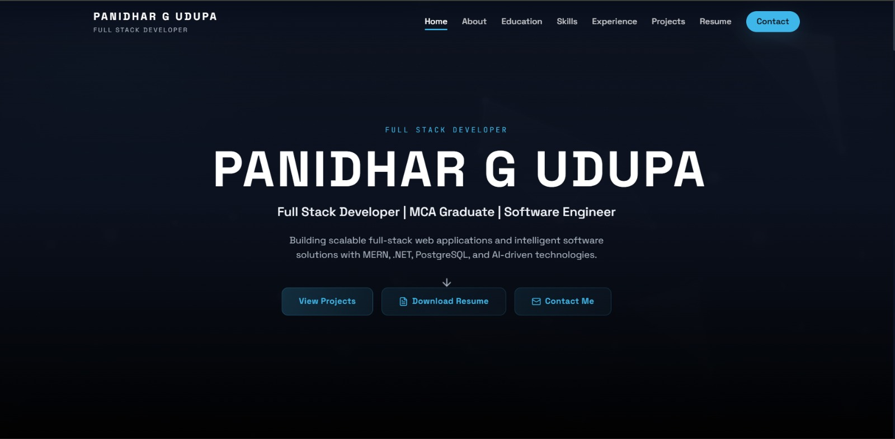
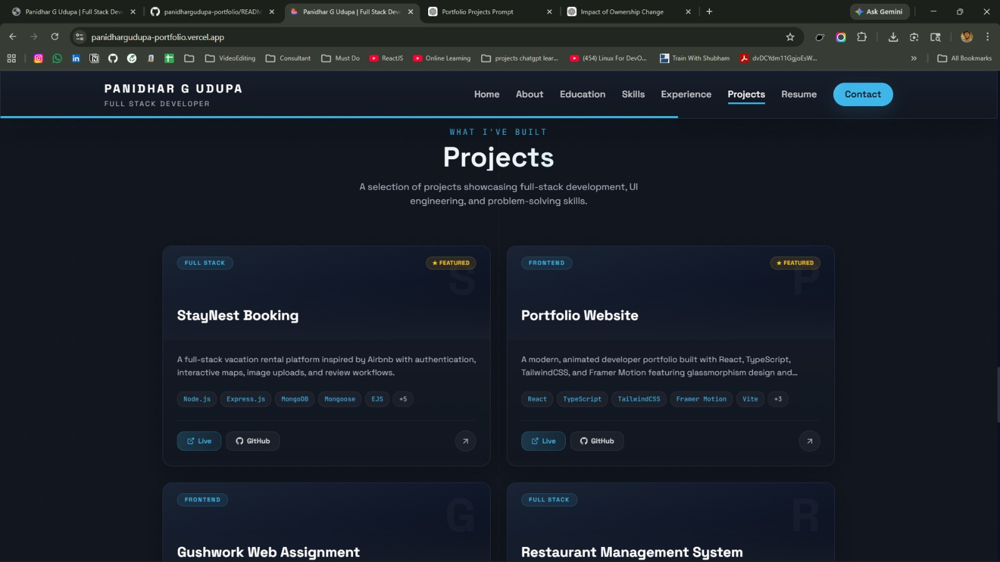
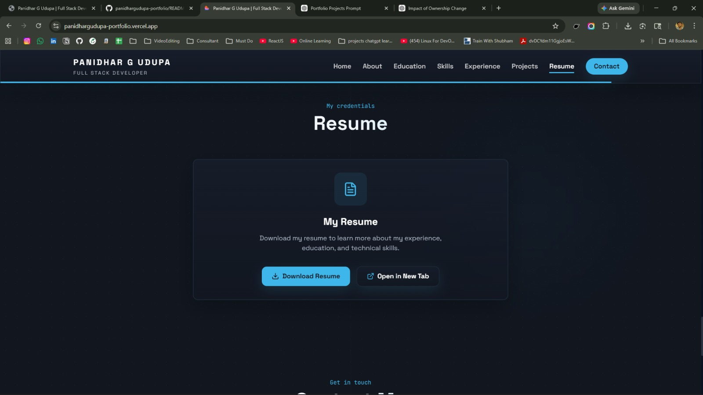
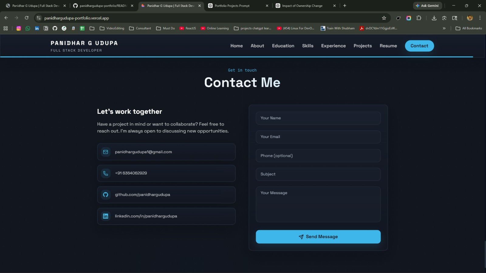
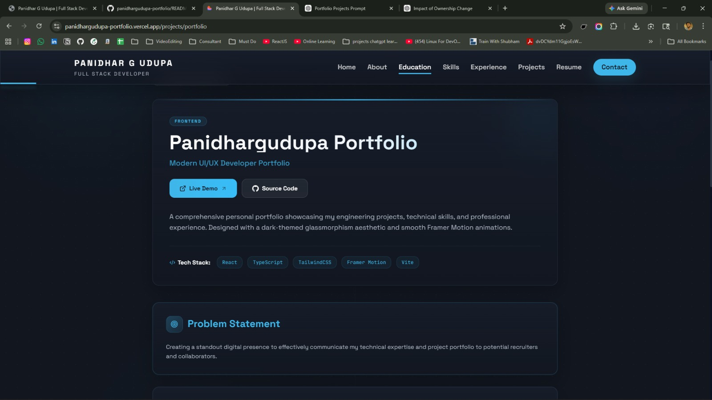

# 🚀 Panidhar G Udupa - Developer Portfolio

<p align="center">
  <b>Full Stack Developer | MCA Graduate | Software Engineer</b><br/>
  <i>Building scalable web applications, modern UI, and real-world solutions</i>
</p>

<p align="center">
  <a href="https://panidhargudupa-portfolio.vercel.app">
    
  </a>
  <a href="https://github.com/panidhargudupa">
    
  </a>
</p>

---

## 📌 Overview

This is my personal developer portfolio built to showcase my projects, technical skills, and experience as a Full Stack Developer.

The portfolio focuses on clean UI, recruiter-friendly design, and modern frontend architecture, along with showcasing real-world projects across Full Stack, Frontend, and Machine Learning domains.

---

## ✨ Features

- 📂 Project showcase with GitHub & Live links
- 🧠 Skills & Tech stack section
- 🎓 Education timeline
- 💼 Experience section
- 📄 Resume download
- 📬 Contact form
- ⚡ Smooth animations
- 📱 Fully responsive design

---

## 🛠️ Tech Stack

Frontend: React, TypeScript  
Styling: TailwindCSS  
Animations: Framer Motion  
Build Tool: Vite  
Deployment: Vercel  

---

## 📂 Project Structure

```bash
panidhargudupa-portfolio/
│
├── public/               # Static assets
├── src/
│   ├── components/       # Reusable UI components
│   ├── pages/            # Pages (Home, Projects, etc.)
│   ├── data/             # Static data (projects, etc.)
│   ├── hooks/            # Custom hooks
│   ├── styles/           # Global styles
│   ├── App.tsx           # Root component
│   └── main.tsx          # Entry point
│
├── package.json
├── tailwind.config.js
└── vite.config.ts
```
---

## 📸 Screenshots







---

## ⚙️ How to Use

git clone https://github.com/panidhargudupa/panidhargudupa-portfolio.git  
cd panidhargudupa-portfolio  
npm install  
npm run dev  

---

## 🏗️ Build

npm run build  
npm run preview  

---

## 🌐 Deployment

Platform: Vercel  

Steps:
1. Push code to GitHub  
2. Connect repo to Vercel  
3. Deploy  

Live:
https://panidhargudupa-portfolio.vercel.app  

---

## 📚 What I Learned

- Building scalable React apps  
- TailwindCSS UI design  
- Component-based architecture  
- Animations using Framer Motion  
- Full-stack + ML integration  

---

## 🔮 Future Improvements

- Add blog section  
- GitHub API integration  
- Improve SEO  
- Add admin dashboard  

---

## 👨‍💻 Author

Panidhar G Udupa  
https://github.com/panidhargudupa  

---

## 📄 License / Copyright

© 2026 Panidhar G Udupa. All rights reserved.  

This project is for personal portfolio use only.  
Unauthorized copying or redistribution is not allowed.

---
